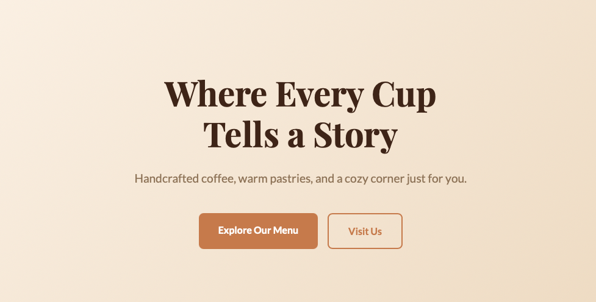
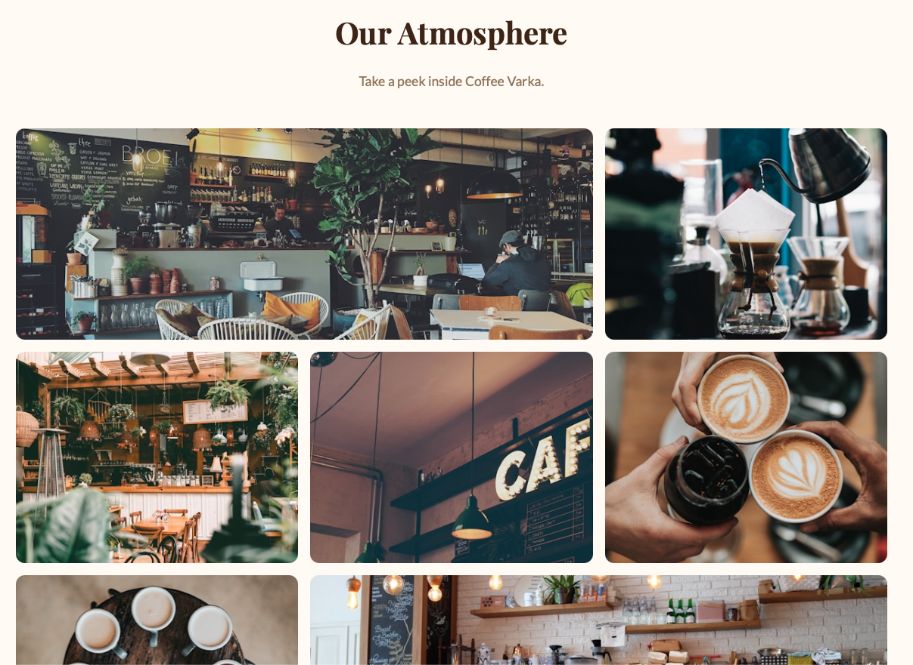

# Coffee Varka — Landing Page

A landing page for **Coffee Varka**, a cozy coffee shop in Chisinau, Moldova. Built with vanilla HTML and CSS as part of the PWeb Lab 2 assignment.

## About

Coffee Varka is a warm, welcoming coffee shop offering handcrafted drinks, fresh pastries, and a cozy atmosphere. This landing page showcases the shop's menu, story, guest reviews, and gallery.

## Sections

- **Hero** — tagline with call-to-action buttons
- **About** — the story behind Coffee Varka
- **Menu** — drinks and pastries with prices
- **Testimonials** — guest reviews
- **Gallery** — photo grid of the cafe atmosphere
- **Contact** — contact form, address, and opening hours

## Tech Stack

- HTML5 (semantic markup)
- CSS3 (Flexbox, Grid, CSS variables)
- Google Fonts (Playfair Display, Lato)
- No frameworks or JavaScript

## Screenshots

## Live Demo

[View Live Demo](https://dmracovit.github.io/PWeb/lab2/)

## Author

Dumitru Racovita — FAF, Technical University of Moldova
